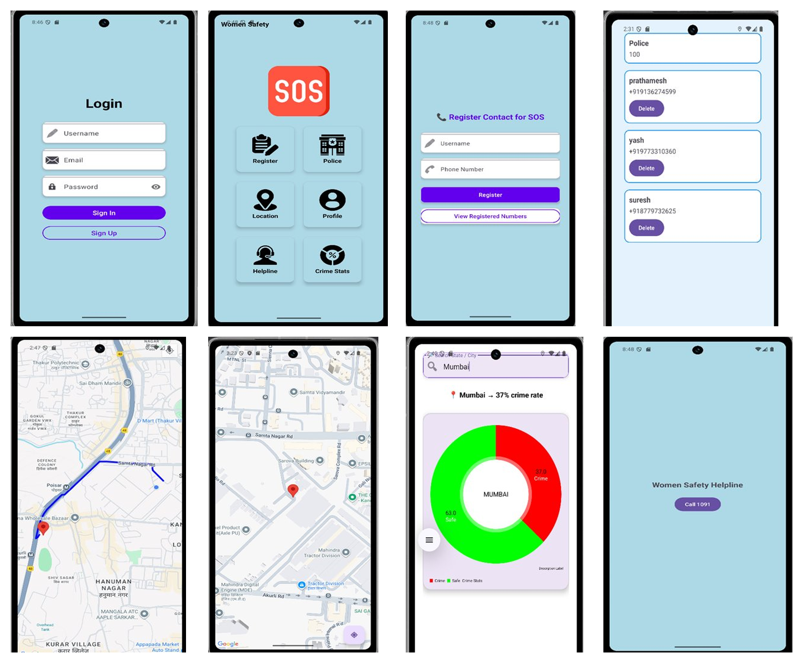

# 🚨 Women Safety App


> An Android application designed to help women quickly alert trusted contacts and authorities during emergencies with one-tap SOS, real-time location sharing, crime statistics, and quick-access helpline numbers.

---

## 📸 App Screenshots

<div align="center">
  
  <br/>
  <i>From left to right: Login, Home Dashboard, Register Contacts, Emergency Contacts, Location Tracking, Live Map, Crime Stats, Helpline</i>
</div>

---

## ✨ Core Features

### 🆘 One-Tap SOS Emergency System
- **Large SOS Button** on home screen - Instantly sends emergency alerts
- **Automatic SMS** to all registered emergency contacts with GPS coordinates
- **Google Maps Link** included in SMS for precise location tracking
- **Optional Auto-Call** to police (100) and emergency contacts
- **Visual & Audio Feedback** with vibration alerts

### 👥 Emergency Contacts Management
- Add unlimited emergency contacts with name and phone number
- View all registered contacts in clean list
- Delete contacts easily with one tap
- Police emergency number (100) pre-configured
- Real-time contact validation

### 📍 Real-Time Location Tracking
- Uses Google Maps for accurate GPS tracking
- Show current location with pin marker
- Live route tracking on map
- Share location link with emergency contacts via SMS
- Works in background for continuous tracking

### 🚓 Police Contact Integration
- Pre-configured Police emergency number (100)
- One-tap direct call to police
- No typing required in emergency situations
- Listed alongside emergency contacts

### 📞 Women's Safety Helpline
- Direct access to Women's Helpline (1091)
- One-tap calling feature
- Clean, distraction-free interface
- Always accessible from home screen

### 📊 Crime Statistics Dashboard
- Search any city/area for crime data
- Visual pie chart showing crime rate percentage
- Green zone (Safe) vs Red zone (Crime) indicators
- Real-time crime statistics for Mumbai and other cities
- Helps users make informed safety decisions

### 🔐 User Authentication
- Secure login system with email and password
- User registration with validation
- Password visibility toggle
- Clean, modern UI with gradient design

---

## 🛠️ Technical Architecture

### Built With

| Technology | Purpose |
|-----------|---------|
| **Kotlin** | Primary Programming Language |
| **Android SDK** | Framework |
| **Firebase Authentication** | User login/registration |
| **Firebase Firestore** | Cloud database for contacts |
| **Room Database** | Local data persistence |
| **Google Maps API** | Location & map visualization |
| **FusedLocationProvider** | GPS & Location Services |
| **Material Design 3** | Modern UI Components |
| **SmsManager** | Emergency SMS functionality |
| **Coroutines** | Asynchronous operations |

### Architecture Pattern
- **MVVM** (Model-View-ViewModel)
- **Repository Pattern** for data abstraction
- **LiveData** for reactive UI updates
- **Single Activity** architecture
- **Kotlin Coroutines** for background tasks

---

## 📋 System Requirements

### Development Environment
- **Android Studio**: Giraffe or later
- **JDK**: Version 11 or higher
- **Gradle**: 8.0+
- **Kotlin**: 1.9.0+

### Android Device Requirements
- **Min SDK**: 21 (Android 5.0 Lollipop)
- **Target SDK**: 34 (Android 14)
- **GPS**: Required
- **Internet**: Required for Maps and Crime Stats
- **SMS**: Required for emergency alerts

---

## 🚀 Getting Started

### Step 1: Clone the Repository

```bash
git clone https://github.com/PRATHAMESHGORAD/women-safety-app.git
cd women-safety-app
```

### Step 2: Open in Android Studio

1. Launch **Android Studio**
2. Select **File → Open**
3. Navigate to the cloned project folder
4. Wait for Gradle sync to complete

### Step 3: Configure Firebase

1. Go to [Firebase Console](https://console.firebase.google.com/)
2. Create a new project or use existing
3. Add Android app with package name: `com.prathamesh.womensafetyapp`
4. Download `google-services.json`
5. Place it in `app/` folder

### Step 4: Configure Google Maps API

1. Get your API key from [Google Cloud Console](https://console.cloud.google.com/)
2. Open `app/src/main/res/values/google_maps_api.xml`
3. Add your key:
```xml
<string name="google_maps_key">YOUR_API_KEY_HERE</string>
```

### Step 5: Grant Required Permissions

The app will request these permissions at runtime:
- 📍 **Location** (Fine & Coarse) - For GPS tracking
- 📱 **Send SMS** - For emergency alerts
- ☎️ **Make Phone Calls** - For calling police/contacts
- 📳 **Vibration** - For alert feedback
- 🌐 **Internet** - For maps and crime stats

### Step 6: Build and Run

1. Connect your Android device or start an emulator
2. Click **Run** button (▶️) or press `Shift + F10`
3. Select your device
4. App will install and launch

---

## 📁 Project Structure

```
app/
├── src/
│   ├── main/
│   │   ├── java/com/prathamesh/womensafetyapp/
│   │   │   ├── MainActivity.kt                    # Home dashboard
│   │   │   ├── LoginActivity.kt                   # User authentication
│   │   │   ├── RegisterActivity.kt                # Register new contacts
│   │   │   ├── RegisteredNumbersActivity.kt       # View all contacts
│   │   │   ├── LocationActivity.kt                # Live location tracking
│   │   │   ├── PoliceStationActivity.kt          # Police & contacts list
│   │   │   ├── CrimeStatsActivity.kt             # Crime statistics
│   │   │   ├── HelplineActivity.kt               # Women's helpline
│   │   │   ├── ProfilePageActivity.kt            # User profile
│   │   │   ├── LauncherActivity.kt               # Splash screen
│   │   │   ├── AppDatabase.kt                    # Room database
│   │   │   ├── User.kt                           # User data model
│   │   │   ├── UserDao.kt                        # Database operations
│   │   │   ├── UserAdapter.kt                    # RecyclerView adapter
│   │   │   ├── SOSService.kt                     # Background SOS service
│   │   │   ├── SOSAccessibilityService.kt        # Accessibility features
│   │   │   ├── SmsWorker.kt                      # SMS sending worker
│   │   │   ├── NetworkChangeReceiver.kt          # Network monitoring
│   │   │   └── Uihelpers.kt                      # UI utility functions
│   │   ├── res/
│   │   │   ├── layout/
│   │   │   │   ├── activity_main.xml
│   │   │   │   ├── activity_login.xml
│   │   │   │   ├── activity_register.xml
│   │   │   │   ├── activity_registered_numbers.xml
│   │   │   │   ├── activity_location.xml
│   │   │   │   ├── activity_crime_stats.xml
│   │   │   │   ├── activity_helpline.xml
│   │   │   │   └── item_user.xml
│   │   │   ├── drawable/
│   │   │   │   ├── sos.png
│   │   │   │   ├── register.png
│   │   │   │   ├── police.png
│   │   │   │   ├── location.png
│   │   │   │   ├── profile.png
│   │   │   │   ├── helpline.png
│   │   │   │   ├── crime.png
│   │   │   │   └── background_gradient.xml
│   │   │   └── values/
│   │   │       ├── strings.xml
│   │   │       ├── colors.xml
│   │   │       └── google_maps_api.xml
│   │   └── AndroidManifest.xml
│   └── build.gradle.kts
└── build.gradle.kts
```

---

## 🔧 Key Implementation Details

### 1. SOS Emergency Flow

```kotlin
// Send SMS to all registered contacts
private fun sendEmergencySMS(location: String) {
    val smsManager = SmsManager.getDefault()
    val message = "🚨 EMERGENCY! I need help immediately!\n" +
                  "My location: $location\n" +
                  "Name: ${userName}\n" +
                  "Time: ${getCurrentTime()}"
    
    contacts.forEach { contact ->
        try {
            smsManager.sendTextMessage(
                contact.phoneNumber,
                null,
                message,
                null,
                null
            )
        } catch (e: Exception) {
            Log.e("SMS", "Failed to send to ${contact.name}")
        }
    }
}
```

### 2. Live Location Tracking

```kotlin
// Get current location using FusedLocationProvider
fusedLocationClient.getCurrentLocation(
    Priority.PRIORITY_HIGH_ACCURACY,
    cancellationTokenSource.token
).addOnSuccessListener { location ->
    if (location != null) {
        val lat = location.latitude
        val lng = location.longitude
        val mapsLink = "https://maps.google.com/?q=$lat,$lng"
        
        // Update map marker
        updateMapMarker(LatLng(lat, lng))
        
        // Send location via SMS
        sendEmergencySMS(mapsLink)
    }
}
```

### 3. Room Database Schema

```kotlin
@Entity(tableName = "users")
data class User(
    @PrimaryKey(autoGenerate = true)
    val id: Int = 0,
    val name: String,
    val phoneNumber: String,
    val timestamp: Long = System.currentTimeMillis()
)

@Dao
interface UserDao {
    @Query("SELECT * FROM users")
    fun getAllUsers(): LiveData<List<User>>
    
    @Insert
    suspend fun insertUser(user: User)
    
    @Delete
    suspend fun deleteUser(user: User)
}
```

### 4. Crime Statistics Calculation

```kotlin
private fun calculateCrimeRate(city: String): CrimeData {
    // Fetch crime data from API or database
    val crimeCount = getCrimeCount(city)
    val safeCount = getSafeCount(city)
    val total = crimeCount + safeCount
    
    val crimePercentage = (crimeCount.toFloat() / total * 100).toInt()
    val safePercentage = 100 - crimePercentage
    
    return CrimeData(
        city = city,
        crimeRate = crimePercentage,
        safeRate = safePercentage
    )
}
```

---

## 📦 Dependencies (build.gradle.kts)

```kotlin
dependencies {
    // Core Android
    implementation("androidx.core:core-ktx:1.12.0")
    implementation("androidx.appcompat:appcompat:1.6.1")
    implementation("com.google.android.material:material:1.11.0")
    implementation("androidx.constraintlayout:constraintlayout:2.1.4")
    
    // Firebase
    implementation(platform("com.google.firebase:firebase-bom:32.7.0"))
    implementation("com.google.firebase:firebase-auth-ktx")
    implementation("com.google.firebase:firebase-firestore-ktx")
    
    // Google Maps
    implementation("com.google.android.gms:play-services-maps:18.2.0")
    implementation("com.google.android.gms:play-services-location:21.1.0")
    
    // Room Database
    implementation("androidx.room:room-runtime:2.6.1")
    implementation("androidx.room:room-ktx:2.6.1")
    ksp("androidx.room:room-compiler:2.6.1")
    
    // Coroutines
    implementation("org.jetbrains.kotlinx:kotlinx-coroutines-android:1.7.3")
    
    // Lifecycle Components
    implementation("androidx.lifecycle:lifecycle-viewmodel-ktx:2.7.0")
    implementation("androidx.lifecycle:lifecycle-livedata-ktx:2.7.0")
    
    // Chart Library (for crime stats)
    implementation("com.github.PhilJay:MPAndroidChart:v3.1.0")
    
    // WorkManager (for background tasks)
    implementation("androidx.work:work-runtime-ktx:2.9.0")
}
```

---

## 🔐 Required Permissions (AndroidManifest.xml)

```xml
<!-- Location -->
<uses-permission android:name="android.permission.ACCESS_FINE_LOCATION"/>
<uses-permission android:name="android.permission.ACCESS_COARSE_LOCATION"/>
<uses-permission android:name="android.permission.ACCESS_BACKGROUND_LOCATION"/>

<!-- Communication -->
<uses-permission android:name="android.permission.SEND_SMS"/>
<uses-permission android:name="android.permission.CALL_PHONE"/>
<uses-permission android:name="android.permission.READ_PHONE_STATE"/>

<!-- Network -->
<uses-permission android:name="android.permission.INTERNET"/>
<uses-permission android:name="android.permission.ACCESS_NETWORK_STATE"/>

<!-- Other -->
<uses-permission android:name="android.permission.VIBRATE"/>
<uses-permission android:name="android.permission.WAKE_LOCK"/>
<uses-permission android:name="android.permission.FOREGROUND_SERVICE"/>
```

---

## 📱 How to Use the App

### First Time Setup
1. **Register/Login** - Create account with email and password
2. **Add Emergency Contacts** - Tap "Register" and add at least 3 trusted contacts
3. **Grant Permissions** - Allow location, SMS, and phone permissions
4. **Test Location** - Open location screen to verify GPS is working

### In Emergency Situation
1. **Open App** - Launch Women Safety App
2. **Tap Large SOS Button** - Red SOS button on home screen
3. **Automatic Actions**:
   - SMS sent to all registered contacts with your location
   - Google Maps link included in SMS
   - Location continuously tracked
   - Optional: Auto-call to police (100)

### Other Features
- **View Crime Stats** - Search any city to see crime rate
- **Call Helpline** - Direct call to Women's Helpline (1091)
- **View Contacts** - See all registered emergency contacts
- **Track Location** - Open live location on map anytime

---

## 🧪 Testing Checklist

- [x] User registration and login flow
- [x] Add/view/delete emergency contacts
- [x] SOS button sends SMS to all contacts
- [x] Location tracking and map display
- [x] Google Maps link generation
- [x] Direct call to police (100)
- [x] Women's helpline (1091) calling
- [x] Crime statistics for multiple cities
- [x] Permission handling (grant/deny scenarios)
- [x] Background location tracking
- [x] SMS sending in low network
- [x] App works in battery optimization mode
- [x] Foreground service for continuous tracking

---

## 🐛 Known Issues & Limitations

- SMS may fail if device has SMS restrictions enabled
- Location accuracy depends on GPS signal strength
- Background location tracking limited by battery optimization settings
- Crime statistics currently show static data (API integration needed)
- Requires active internet for Google Maps
- Android 13+ requires notification permissions for SMS delivery status

---

## 🗺️ Future Enhancements

### Version 2.0 Roadmap
- [ ] **Live Crime API Integration** - Real-time crime data from police database
- [ ] **Audio/Video Recording** - Automatic recording during emergency
- [ ] **Fake Call Feature** - Simulate incoming call to escape situations
- [ ] **Shake to Alert** - Activate SOS by shaking phone
- [ ] **Voice Command** - "Hey Safety" voice activation
- [ ] **Community Safety Network** - Connect with nearby users
- [ ] **AI Threat Detection** - Analyze location and time for risk
- [ ] **Cloud Backup** - Backup contacts and profile to cloud
- [ ] **Multi-language Support** - Hindi, Marathi, Tamil, etc.
- [ ] **Wearable Integration** - Smartwatch SOS button
- [ ] **Police Control Room Integration** - Direct connection to police
- [ ] **Lock Screen Widget** - Quick access without unlocking

---

## 🤝 Contributing

Contributions are welcome! Here's how you can help:

1. **Fork** the repository
2. **Create** your feature branch: `git checkout -b feature/AmazingFeature`
3. **Commit** your changes: `git commit -m 'Add AmazingFeature'`
4. **Push** to branch: `git push origin feature/AmazingFeature`
5. **Open** a Pull Request

### Contribution Guidelines
- Follow Kotlin coding standards
- Write meaningful commit messages
- Add comments for complex logic
- Update README if adding new features
- Test thoroughly before submitting PR

---

## 📄 License

This project is licensed under the **MIT License** - see the [LICENSE](LICENSE) file for details.

---

## 👨‍💻 Developer

**Prathamesh Gorad**
- 📧 Email: prathameshgorad@example.com
- 💼 LinkedIn: [Prathamesh Gorad](https://linkedin.com/in/prathameshgorad)
- 🐙 GitHub: [@PRATHAMESHGORAD](https://github.com/PRATHAMESHGORAD)
- 📱 College Project: Women Safety App

---

## 🙏 Acknowledgements

- **College Guide** - For project guidance and support
- [Android Developers](https://developer.android.com/) - Official documentation
- [Material Design](https://material.io/) - UI/UX guidelines
- [Google Maps Platform](https://developers.google.com/maps) - Location services
- [Firebase](https://firebase.google.com/) - Backend services
- [Stack Overflow](https://stackoverflow.com/) - Community support
- **Women's Safety Organizations** - For valuable feedback and insights

---

## 📞 Important Helpline Numbers (India)

| Service | Number | Description |
|---------|--------|-------------|
| **Women Helpline** | **1091** | 24x7 Women's helpline |
| **Police** | **100** | Emergency police |
| **National Emergency** | **112** | All emergencies |
| **Ambulance** | **102, 108** | Medical emergency |
| **NCW Helpline** | **7827170170** | National Commission for Women |
| **Women Power Helpline** | **1091/1291** | State-specific |
| **Child Helpline** | **1098** | For children in distress |

---

## ⚠️ Important Notice

This app is designed to **assist in emergency situations** but should NOT be considered a replacement for:
- Professional emergency services
- Local police authorities
- Medical emergency services

**Always prioritize:**
1. **Call 100** (Police) immediately in danger
2. **Run to a safe location** if possible
3. **Shout for help** to attract attention
4. **Use this app** as a supplementary safety tool

**Remember:** Your safety is paramount. This app is a tool to help, but quick thinking and immediate action are most important in emergencies.

---

## 📊 App Statistics

- **Development Time:** 3 months
- **Total Screens:** 9+
- **Lines of Code:** 3000+
- **Tested On:** Android 8.0 to Android 14
- **Target Users:** Women, Students, Working Professionals
- **Languages:** English (More coming soon)

---

## 🎓 Academic Information

**Project Type:** Final Year Engineering Project  
**Domain:** Android Development & Women Safety  
**Technologies:** Kotlin, Firebase, Google Maps, Room Database   
**Year:** 2024-2025

---

<div align="center">

## 🚨 Download Women Safety App

**Latest Version:** v1.0.0  
**Release Date:** December 2024  
**Size:** ~15 MB

### [📥 Download APK](https://github.com/PRATHAMESHGORAD/women-safety-app/releases)

---

<p>Made with ❤️ for Women's Safety</p>
<p>⭐ Star this repo if you found it helpful!</p>
<p>🔄 Share with friends and family to spread awareness</p>

### Stay Safe. Stay Connected. Stay Empowered. 💪

</div>